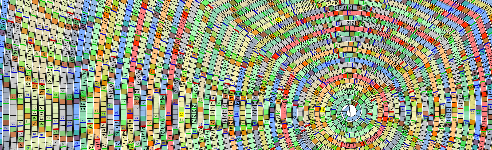

# Spiralife Calendar Generator

1. **Description**
    *   This project generates a visually unique spiral calendar as an SVG Image.
    *   It is designed to run directly in a web browser. 
    *   The generated calendar visualizes a span of days in a continuous spiral, with customizable colors, date ranges, and highlighting for special occasions.

2. **Online Demo**
    *   A online demo is availabe at [spiralife.debablo.de](https://spiralife.debablo.de)

3. **Install Dependencies and Build:**
    *   Open the folder of this repository in a terminal.
    *   Run the following commands:
         ```bash
         npm install .
         npm run build
         ```
    *   This will install the necessary dependencies and build the project.
    *   The built files will be located in the `dist/` directory.

4. **Run locally:**
    *   The project can be run locally using a development server.
    *   After building the project, run the following command:
         ```bash
         npx webpack serve --open
         ```
    *   This will start a local development server and open the application in your default web browser.
    *   The application will be accessible at `http://localhost:8080` by default.
    *   Any changes made to the source files will automatically reload the application in the browser.
